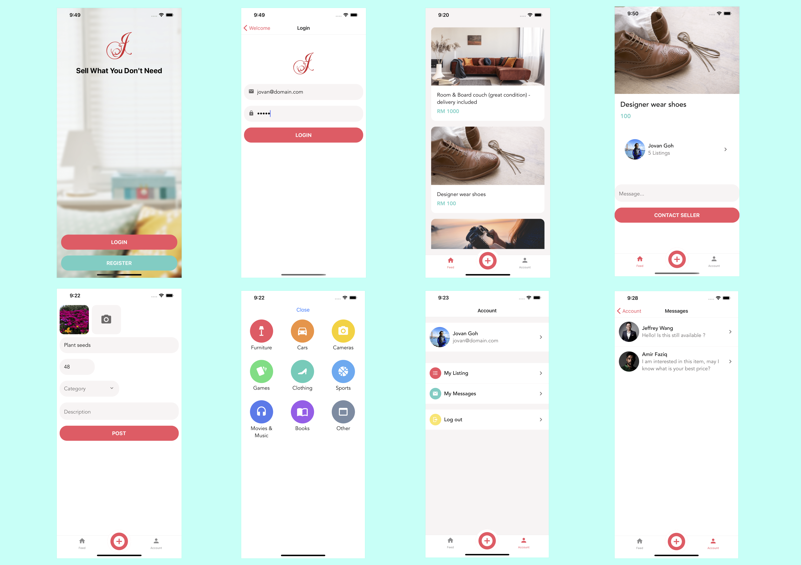

# Jo Preloved Market Place
An online platform to sell my pre-loved items which I no longer need. This project is built by [expo](https://docs.expo.dev/), a set of tools and services built around React Native and native platforms.




## Getting started
Make sure you have either the LTS version or current version of Node.js installed.
Also, make sure your machine has the Expo CLI Installed, otherwise `npm install -g expo-cli`

```bash
# Install dependencies
npm install or yarn install

# Start the App
# - The Expo CLI will provide options to open in [web, android or iOS] — Suggest to run on iOS
npm start or yarn start

```

### Technologies Used/ Features
React Navigation, Animations, Formik, Authentication & Authorization, Push Notifications, Image Caching, Error Logging.
